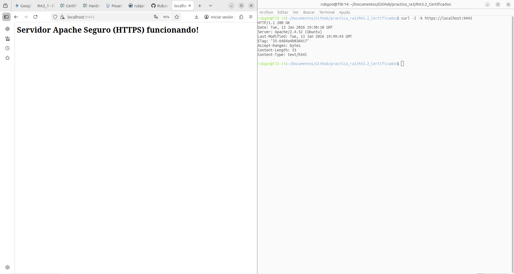

# Práctica 3.2.1: Servidor Apache Seguro con SSL (HTTPS)

## 📖 Descripción
En este ejercicio se ha configurado un servidor web **Apache** dentro de un contenedor Docker para soportar conexiones seguras (**HTTPS**) mediante la generación e instalación de un **certificado digital autofirmado** con OpenSSL.

## 🛠️ Tecnologías Utilizadas
* **Base:** Ubuntu 22.04.
* **Servidor Web:** Apache2.
* **Cifrado:** OpenSSL (Generación de claves RSA 2048-bit y certificado X.509).
* **Módulos Apache:** `mod_ssl` habilitado y configurado como `default-ssl`.

## 🚀 Instrucciones de Despliegue

### 1. Construir la imagen
```bash
docker build -t apache-ssl .
```

### 2. Arrancar el contenedor
Se expone el puerto seguro estándar (443) del contenedor al puerto **9443** del host para evitar conflictos.
```bash
docker run -d -p 9443:443 --name mi-apache-ssl apache-ssl
```

## ✅ Evidencias de Funcionamiento

### Verificación Dual (Navegador + Terminal)
Se ha comprobado el correcto funcionamiento del servidor seguro mediante dos vías:
1.  **Navegador:** Acceso a `https://localhost:9443` mostrando el mensaje de éxito (tras aceptar la advertencia del certificado autofirmado).
2.  **Terminal:** Comando `curl -I -k` confirmando la respuesta `HTTP 200 OK` a través del puerto SSL y mostrando la cabecera `Server: Apache`.



## ☁️ Docker Hub
Comandos para subir la imagen al repositorio:
```bash
docker login
docker tag apache-ssl rubjargon/apache-ssl:v1
docker push rubjargon/apache-ssl:v1
```

---
**Autor:** rubjargon
